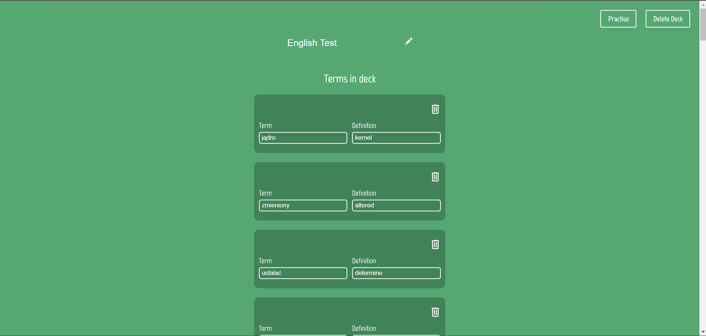

# Flashcards
Creator of flashcard sets with learning mode. The user creates an account and created sets are stored using Firebase.

# Link to the app:
https://flash-cards-b1b45.web.app/

# Tech stack: 
- React
- Firebase
- Next.js
